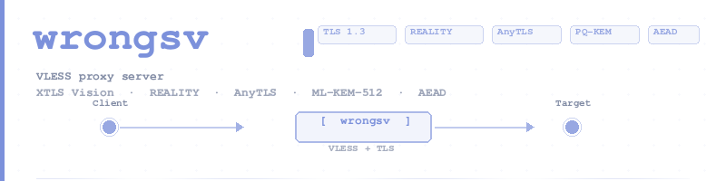

<p align="center">
  <picture>
    <source media="(prefers-color-scheme: dark)" srcset="assets/banner.png">
    
  </picture>
</p>

<p align="center">
  <a href="LICENSE"></a>
  <a href="#"></a>
  
  
  
  
  
  
  
  
</p>

---

A minimal, high-performance proxy server with VLESS, XTLS Vision flow, REALITY / AnyTLS / plain TLS / WebSocket / HTTPUpgrade transport layers, VLESS raw UDP / packetaddr UDP / WebSocket Mux.Cool/XUDP UDP relay, Shadowsocks AEAD/AEAD-2022 TCP/UDP inbound, mixed SOCKS4/4A/SOCKS5/HTTP proxy inbound, and Trojan TLS TCP/UDP inbound.

## Architecture

```
wrongsv (binary)
├── server          — inbound handler, config, connection relay
├── reality         — REALITY TLS 1.3 authentication with spider fallback
├── anytls          — AnyTLS TLS disguise with SHA-256 password auth + fallback
├── shadowsocks     — Shadowsocks AEAD/AEAD-2022 TCP/UDP codec and relay
├── mixed proxy     — SOCKS4/4A, SOCKS5 CONNECT, and HTTP forward/CONNECT inbound relay
├── trojan          — Trojan over TLS TCP/UDP inbound relay with fallback
├── vless           — user validator, XTLS Vision padding/unpadding
├── vless-encoding  — VLESS header codec, addons protobuf, body framing
├── encryption      — AEAD (AES-256-GCM / ChaCha20-Poly1305)
├── protocol        — shared types (RequestHeader, MemoryUser, ID, AddressParser)
├── net-types       — Address, Port, AddressFamily
└── uuid            — UUID v4/v5, ProcessUUID masking
```

## Features

- **VLESS** — stateless proxy with UUID authentication and extensible addons
- **VLESS UDP packetaddr** — V2Ray 5+ `sp.packet-addr.v2fly.arpa` packet-address UDP relay across raw TCP, TLS/REALITY/AnyTLS, and WebSocket carriers
- **VLESS WebSocket** — raw WS/TLS+WS carrier with pipelined TCP payloads, raw UDP packets, and Mux.Cool/XUDP UDP over WS
- **VLESS HTTPUpgrade** — V2Ray/Xray HTTP/1.1 upgrade carrier with raw post-101 VLESS TCP/UDP/packetaddr relay and real-client sing-box/mihomo/xray coverage
- **Shadowsocks AEAD/AEAD-2022 TCP/UDP** — classic `aes-128-gcm`, `aes-256-gcm`, `chacha20-ietf-poly1305`, plus required `2022-blake3-aes-128-gcm` and `2022-blake3-aes-256-gcm`
- **Mixed proxy inbound** — SOCKS4/4A, SOCKS5 CONNECT, HTTP absolute-form forwarding, and HTTP CONNECT; optional shared credentials apply to SOCKS5/HTTP and disable SOCKS4/4A
- **Trojan TLS TCP/UDP inbound** — SHA224 password authentication, SOCKS5-style destination headers, pipelined TCP payload relay, UDP ASSOCIATE packet relay, and decrypted plaintext fallback
- **REALITY** — TLS 1.3 handshake hijacking, X25519 ECDH auth, dynamic certs, spider fallback
- **AnyTLS** — TLS 1.3 + SHA-256 password auth with configurable padding
- **Plain TLS** — Standard TLS 1.3, compatible with sing-box/mihomo/xray-core `tls` transport
- **XTLS Vision** — traffic analysis resistance via padding/unpadding
- **Probe resistance** — unauthenticated connections forwarded to fallback destinations
- **Client config generation** — auto-generate config JSON for sing-box and mihomo/FlClash

## Quick Start

[docs/setup.md](docs/setup.md) has the full build and configuration guide.
[docs/config-generation.md](docs/config-generation.md) covers randomized main config generation and validation.
[docs/deploy.md](docs/deploy.md) covers automated remote deployment, and [docs/simple-deploy.md](docs/simple-deploy.md) remains the manual TLS and REALITY walkthrough.
[docs/client-compatibility.md](docs/client-compatibility.md) covers capability-gated client export and external E2E coverage.
[docs/benchmarks.md](docs/benchmarks.md) covers criterion and traffic benchmark workflows.
[docs/migration-notes.md](docs/migration-notes.md) records user-visible behavior changes for config generation and client export.
[docs/testing.md](docs/testing.md) covers the local and external verification commands, including the machine-readable review-evidence checks.
[docs/security.md](docs/security.md) documents generated secret handling and file permissions.

### Review Evidence

When `../wrongsv-external-tests` is present, you can run the standing external
review checks from the `wrongsv` repo root with:

```bash
# One-shot local + external review evidence bundle
node scripts/verify-review-evidence.js --standing-only xray-webtransport

# Local-only aggregate check when the sibling repo is unavailable
node scripts/verify-review-evidence.js --skip-external --output-file /tmp/wrongsv-review-evidence-summary.json

# Standing-limitations-only external recheck
node scripts/recheck-external-standing-limitations.js --only xray-webtransport

# Persist the combined JSON summary to a file
node scripts/verify-review-evidence.js \
  --standing-only xray-webtransport \
  --output-file /tmp/wrongsv-review-evidence-summary.json
```

When you pass `--output-root` instead, the wrapper now writes a default
`wrongsv-review-evidence-summary.json` alongside the external artifacts in that
directory. The external half of that bundle now includes the process-core
client scan summary (`coreClientScans`) plus the Hiddify packaged-core scan
summary (`hiddifyCoreScan`) in addition to the docs check and the
standing-limitation rechecks.

### Build

```bash
cargo build --release
```

### Configure

Pick an example from [`configs/`](configs/):

| Config | Transport | Flow | Notes |
|--------|-----------|------|-------|
| [`tls-vision.toml`](configs/tls-vision.toml) | Plain TLS | Vision | Recommended — TLS + DPI resistant |
| [`reality-vision.toml`](configs/reality-vision.toml) | REALITY TLS | Vision | ECDH auth + spider fallback |
| [`anytls-vision.toml`](configs/anytls-vision.toml) | AnyTLS | Vision | Password auth |
| [`tls-tcp.toml`](configs/tls-tcp.toml) | Plain TLS | none | TLS encryption, no Vision |
| [`basic-tcp.toml`](configs/basic-tcp.toml) | raw TCP | none | Simplest setup |
| [`httpupgrade.toml`](configs/httpupgrade.toml) | HTTPUpgrade | none | HTTP/1.1 101 upgrade, raw VLESS stream |
| [`ws-tcp.toml`](configs/ws-tcp.toml) | WebSocket | none | VLESS over WebSocket carrier |
| [`ws-udp.toml`](configs/ws-udp.toml) | WebSocket | none | VLESS WS + UDP relay |
| [`grpc.toml`](configs/grpc.toml) | gRPC | none | HTTP/2 gRPC Hunk framing |
| [`xhttp.toml`](configs/xhttp.toml) | XHTTP | none | HTTP/2 raw byte streaming |
| [`quic.toml`](configs/quic.toml) | QUIC | none | UDP/TLS 1.3 bidirectional streams |
| [`kcp.toml`](configs/kcp.toml) | mKCP | none | UDP-based KCP with FNV1a auth |
| [`webtransport.toml`](configs/webtransport.toml) | WebTransport | none | HTTP/3 WebTransport carrier |
| [`shadowtls.toml`](configs/shadowtls.toml) | ShadowTLS | none | TLS 1.3 + RFC 8446 HMAC auth |
| [`vmess.toml`](configs/vmess.toml) | VMess AEAD | n/a | Standalone VMess AEAD proxy |
| [`shadowsocks-aead.toml`](configs/shadowsocks-aead.toml) | Shadowsocks AEAD | n/a | TCP/UDP relay for Shadowsocks-compatible clients |
| [`shadowsocks-2022.toml`](configs/shadowsocks-2022.toml) | Shadowsocks AEAD-2022 | n/a | TCP/UDP relay for sing-box/mihomo/xray Shadowsocks 2022 clients |
| [`mixed-proxy.toml`](configs/mixed-proxy.toml) | SOCKS4/4A / SOCKS5 / HTTP proxy | n/a | Local/LAN mixed proxy inbound |
| [`trojan-tls.toml`](configs/trojan-tls.toml) | Trojan over TLS | n/a | TCP/UDP relay for Trojan-compatible clients |
| [`hysteria2.toml`](configs/hysteria2.toml) | Hysteria2 | n/a | QUIC-based Hysteria2 inbound |
| [`tuic.toml`](configs/tuic.toml) | TUIC | n/a | QUIC-based TUIC v5 inbound |

Or create a minimal config:

```toml
listen = "0.0.0.0:443"

[[users]]
id = "12345678-1234-1234-1234-123456789abc"
email = "user@example.com"
flow = "xtls-rprx-vision"
```

### Run

```bash
./target/release/wrongsv --config config.toml
```

### Generate client config

```bash
# sing-box format
./target/release/wrongsv --config config.toml --print-client-config \
  --server-host YOUR_IP --servername cloudfront.net --format sing-box

# mihomo/FlClash format
./target/release/wrongsv --config config.toml --print-client-config \
  --server-host YOUR_IP --servername cloudfront.net
```

See [docs/setup.md](docs/setup.md) for all transport options, REALITY keypair
generation, and AnyTLS padding configuration.

## Testing

```bash
cargo test                      # all unit + integration tests
cargo clippy --workspace --all-targets
cargo fmt --all -- --check
```

See [docs/testing.md](docs/testing.md) for the complete test suite including
lifecycle tests (sing-box, mihomo, xray-core), stress tests, and manual proxy
testing procedures. See [docs/benchmarks.md](docs/benchmarks.md) for the
benchmark-specific workflows and published reports.

## Interop

- **xray-core 26.5.9+** — REALITY handshake, Ed25519 certs, Chrome fingerprint
- **sing-box** — REALITY+Vision, packetaddr UDP, WebSocket TCP/XUDP UDP, HTTPUpgrade TCP, TLS+uTLS, Shadowsocks AEAD/2022 TCP/UDP, and Trojan TCP/UDP lifecycle tests passing
- **mihomo / FlClash** — REALITY+Vision, packetaddr UDP, WebSocket TCP/XUDP UDP, HTTPUpgrade TCP, TLS+uTLS, Shadowsocks AEAD/2022 TCP/UDP, and Trojan TCP/UDP full proxy cycle verified
- **xray-core** — WebSocket TCP/XUDP UDP, HTTPUpgrade TCP, Shadowsocks AEAD/2022 TCP/UDP, and Trojan TCP/UDP full proxy cycle verified
- **REALITY spider fallback** — unauthenticated probes forwarded to `dest`
- **AnyTLS echo, Vision, UDP, fallback** — all verified end-to-end
- **Shadowsocks AEAD/2022** — local echo relay coverage for classic TCP/UDP and AEAD-2022 TCP/UDP; real-client sing-box/mihomo/xray lifecycle coverage; codec unit coverage for AES-128-GCM, AES-256-GCM, ChaCha20-Poly1305, and 2022 BLAKE3/AES-GCM framing
- **Mixed SOCKS4/4A/SOCKS5/HTTP proxy** — no-auth and authenticated end-to-end echo coverage
- **Trojan TLS TCP/UDP** — local TLS echo relay coverage, UDP ASSOCIATE coverage, multi-user password coverage, plaintext fallback coverage, and real-client sing-box/mihomo/xray lifecycle coverage
- **Concurrent connections** — 6+ simultaneous REALITY connections, 30 rapid-fire requests, 5×1MB concurrent downloads

## License

MIT
